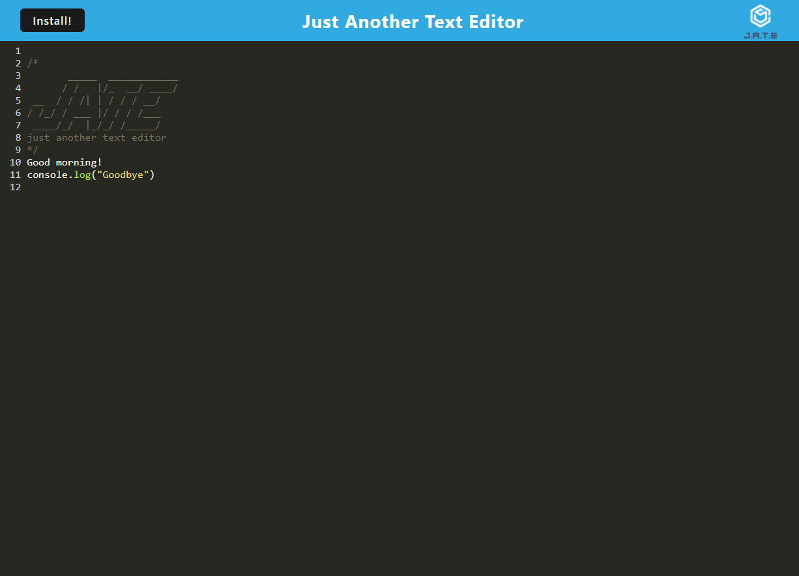

# WebPackTextEditor

WebPackTextEditor is a simple text editor application built using Webpack, PWA (Progressive Web App) features, and IndexedDB for data storage.

## Table of Contents

- [Overview](#overview)
- [Features](#features)
- [Getting Started](#getting-started)
- [Installation](#installation)
- [Usage](#usage)
- [Video](#video)
- [Contributing](#contributing)
- [License](#license)


## Overview

WebPackTextEditor is a web application that combines modern web development technologies to create a text editor with offline capabilities. It uses Webpack for bundling, PWA features for offline usage and installation, and IndexedDB for data storage.

## Video
[](https://drive.google.com/file/d/15c_mp3X8nR7bFaCZuvy3PH9XxrQtQaDd/view?usp=sharing)


## Features

- **Progressive Web App (PWA):** Enjoy an enhanced user experience with offline capabilities and the ability to install the app on supported devices.

- **IndexedDB Integration:** Save and retrieve text content locally using IndexedDB for efficient data storage.

- **Webpack Bundling:** Bundle and optimize your JavaScript, CSS, and assets using Webpack for a performant web application.

- **Intuitive Text Editing:** Provide users with a straightforward and intuitive text editing experience.

- **Customization:** Allow users to customize their text editor environment according to their preferences.

- **Cross-Browser Compatibility:** Ensure compatibility across major web browsers for a seamless user experience.

- **Responsive Design:** Support a responsive design for an optimal viewing experience on various devices.

- **User-Friendly Interface:** Design a clean and user-friendly interface to enhance user interaction.


- **Progressive Web App (PWA):** Enjoy an enhanced user experience with offline capabilities and the ability to install the app on supported devices.
- **IndexedDB Integration:** Save and retrieve text content locally using IndexedDB for efficient data storage.
- **Webpack Bundling:** Bundle and optimize your JavaScript, CSS, and assets using Webpack for a performant web application.

## Getting Started

To get started with WebPackTextEditor, follow the steps below.

### Installation

1. Clone the repository:

   ```bash
   git clone <repository-url>
Install dependencies:

npm install

## Usage

Start the development server:
npm run start

This will build the project and start a development server. Open your browser and navigate to http://localhost:3000 to view the application.

Explore the text editor, utilize PWA features, and test offline capabilities.

[Optional] Customize the application to fit your specific needs.


## Contributing
Contributions are welcome! If you find any issues or have suggestions for improvements, please open an issue or create a pull request. Follow the contributing guidelines for more details.

License
This project is licensed under the MIT License.